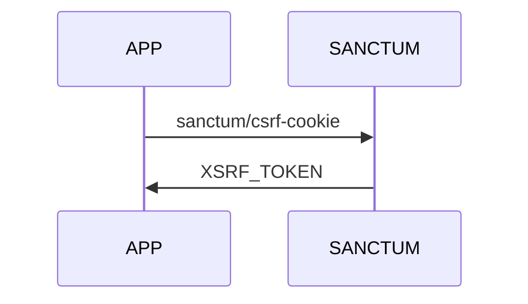
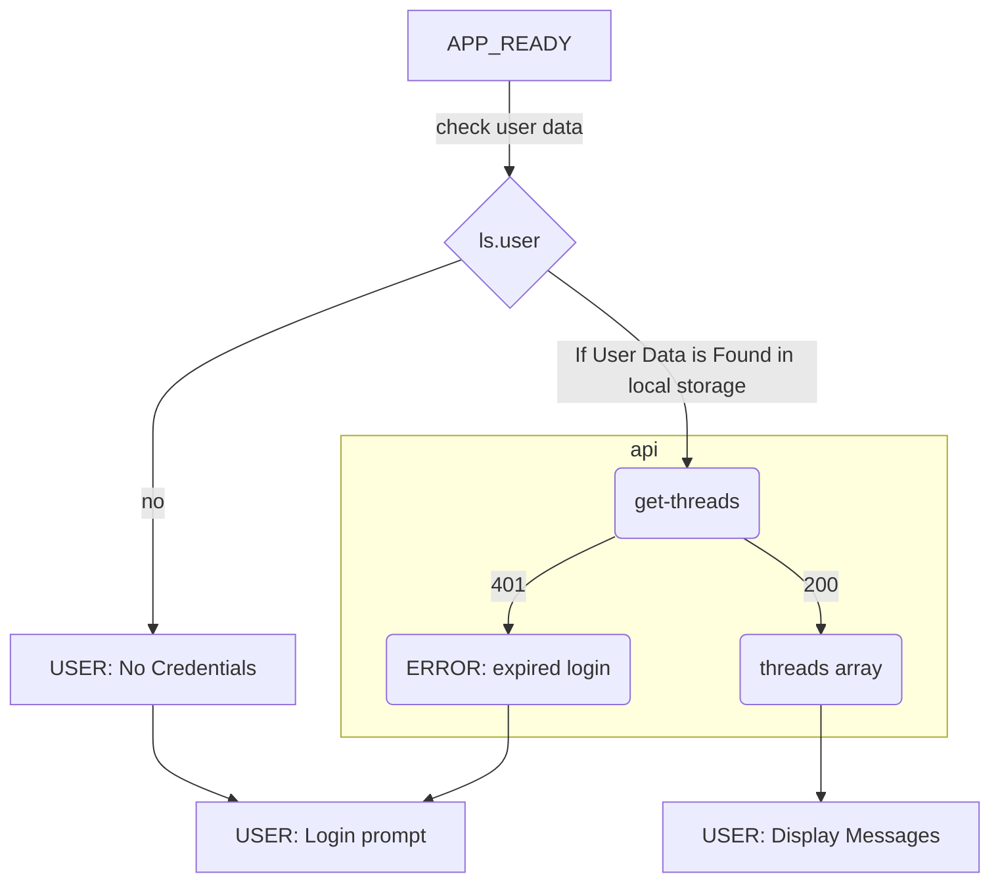

## Application initialization

Before the application starts, axios will make a call to `sanctum/csrf-cookie` to set the **XSRF_TOKEN** in the session header.

### Logging in
Once this connection has been made, the application will check local storage for user data.
 - If the user data is found, it will
	 - pull the model into the client app
	 - make a request to `api/threads` to get the active threads.
 - If the user data is not found, it will Prompt the user to log in

